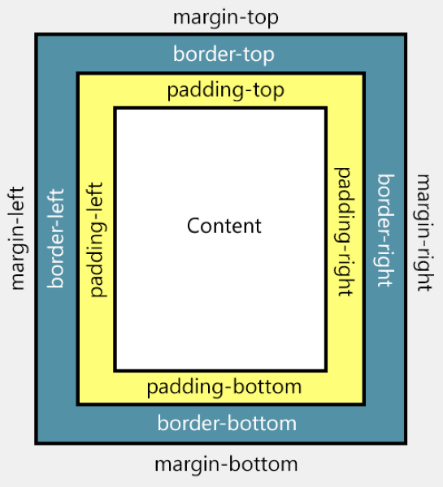
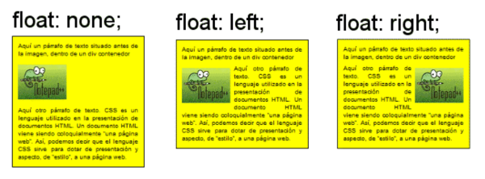
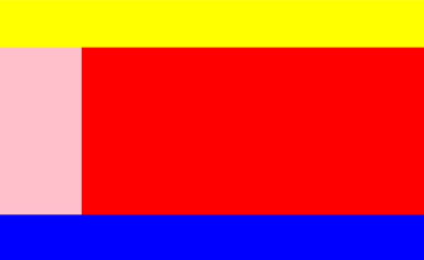
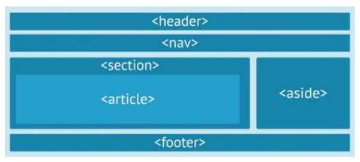
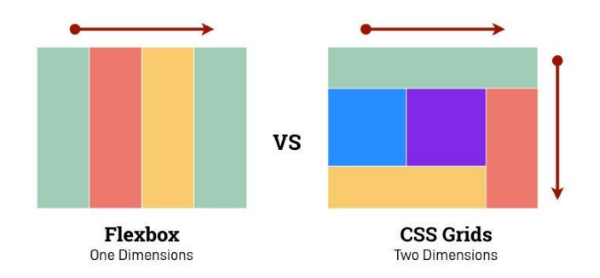
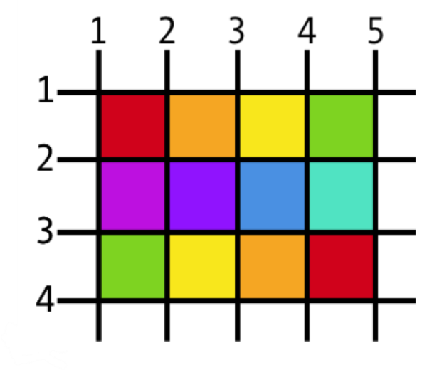
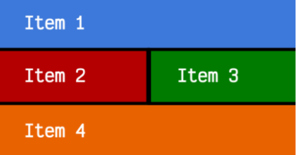

# LLMM - TEMA 3. Repaso 2024-02-15

## Introducción

* El lenguage CSS **añade "estilo" a una página web**: colores, tipos de letra, colocación de los elementos...)
* **CSS** - Cascading Style Sheet - Hojas de estilo en cascada
* Versión más reciente **CSS 3**

## Tres formas de añadir CSS

### (1) Estilo en línea

En el archivo HTML, dentro de las etiquetas.

```html
<p style="color: blue;">Bla, bla, bla</p>
```

### (2) Hojas de estilo internas

En el archivo HTML, dentro de `<head>` usando `<style>`:

```html
<!DOCTYPE html>
<html>
    <head>
        <style>
            p {
                color: blue;
            }
        </style>
    </head>
<body>
    <p>Bla bla bla</p>
 </body>
</html>
```

### (3) Hoja de estilo externa

En otro archivo de extensión .css

```html
<!DOCTYPE html>
<html>
<head>
    <link rel="stylesheet" type"text/css" href="miestilo.css">
</head>
<body>
    <p>Bla bla bla</p>
</body>
</html>
```

```css
p {
    color: blue;
}
```

## Línea para vicular CSS

```html
<link rel="stylesheet" type"text/css" href="miestilo.css">
```

## Sintaxis básica

### color

```css
p {
    color: green;
}
```

### background

```css
p {
    color: green;
    background-color: pink;
}
```

### font

```css
p {
    font-family: 'Comic Sans MS';
    font-size: 50px;

    font-weight: bold;
    font-style: italic;
    text-decoration: underline
}
```

### text-align

`left` `right` `center` `right` `justify`

```css
p {
    text-align: center;
}
```

### width, height

`px` `%`

```css
img {
    width: 50%
    height: 200px;
}
```

### border

* `solid` Línea continua
* `dotted`: Linea punteada
* `dashed` : Linea discontínua

```css
img {
    border-width: 10px;
    border-style: solid;
    border-color: red;
}
```

```css
p {
    border: 10px solid red;
}
```

### id

Se indica con `id` en el HTML y con `#` en el CSS.

>[!IMPORTANT]
>El `id` debe ser único en todo el documento HTML

```html
<body>
    <p>Hola</p>
    <p>Jejeje</p>
    <p id="parrafoRojo">¿Qué tal?</p>
    <p>Me aburro</p>
    <p>Adios</p>
</body>
```

```css
#parrafoRojo {
    color: red;
}
```

### class

Se indica con `class` en el HTML y con `.` en el CSS.

>[!IMPORTANT]
>Al contrario que el `id` la etiqueta `class` la podemos aplicar tantas veces como necesitemos.

```html
<body>
    <p class="parrafoRojo">Hola</p>
    <p>Jejeje</p>
    <p class="parrafoRojo">¿Qué tal?</p>
    <p>Me aburro</p>
    <p class="parrafoRojo">Adios</p>
</body>
```

```css
.parrafoRojo {
    color: red;
}
```

### span

Sirve para darle estilo a una palabra o frase que no tenga etiqueta.

```html
<body>
    <p>Quiero <span style="color: red;">aprobar LLMM</p>
</body>
```

```html
<body>
    <p>Quiero <span id="palabrasRojas">aprobar LLMM</p>
</body>
```

```html
<body>
    <p>Quiero <span class="palabrasRojas">aprobar LLMM</p>
</body>
```

```css
#palabraRoja {
    color: red;
}
.palabrasRojas {
    color: red;
}
```

## Más sintaxis

### list-style-type

Se puede aplicar tanto a `ul`, como a `ol`, como a `li`.

| Valor | Descripción |
|---|---|
| `none` | Ninguno |
| `disc` | Punto |
| `circle` | Circulo |
| `square` | Cuadrado |
| `decimal` | Números |
| `lower-roman` | Números romanos en minúscula |
| `upper-roman` | Números romanos en mayuscula |
| `lower-alpha` | Letras en minúscula |
| `upper-alpha` | Letras en mayúscula |

### list-style-image

Sirve para poner una imagen como icono de los elementos de la lista. Se puede aplicar tanto a `ul`, como a `ol`, como a `li`.

```html
<ul>
    <li>Bulbasur</li>
    <li>Charmander</li>
    <li>Pikachu</li>
```

```css
ul {
    list-style-image: url("pokeball.png");
}
```

### background-image

Sirve para establecer una imagen como fondo.

```css
body {
    background-image: url("fondoChulo.jpg");
}
```

### Añadir comentarios


Comentario en HTML:

`<!-- comentario -->`

Comentario en CSS:

`/* comentario */`

### Pseudo-selectores

Los subselectores especifican una parte de la etiqueta o una situación concreta de esta etiqueta.

| Subselector | Descripción |
|---|---|
| `:first-letter` | Afecta a la primera palabra |
| `:first-line` | Afecta a la primera línea |
| `:link` | Enlace en estado normal |
| `:visited` | Enlace visitado |
| `:active` | Enlace activado |
| `:hover` | Enlace con el puntero por encima |

### Margin vs. Padding



Añade margen por igual a todos los lados:

```css
margin: 20px;
```

Añade margen por separado a cada unos de los lados:

```css
margin-top: 20px;
margin-left: 20px;
margin-right: 20px;
margin-bottom: 20px;
```

Forma alternativa en una sola linea. Los valores están indicados en sentido horario empezando por arriba.

```css
margin: 10px 20px 30px 40px;

```

### Inline vs. Block

**Elementos Inline:** Aparecen en la misma línea, respetando el flujo del documento.

```css
display: inline;
```

**Elementos Block:** Se muestran en una línea independiente.

```css
display: block;
```

### Modelo de cajas

Es un formato que se basa en el hecho que **cada elemento** HTML procuce una **caja/zona rectangular** a su alrededor.

La utilización del modelo de cajas permite establecer una **estructura visual** en la página web dividiendola en **zonas.**

### Flujo del documento

Punto de partida teórico:

* Un elemento se coloca tan **arriba a la izquierda** como sea posible.
* Algunos (block) ocupan toda la línea.
* Cuando se añaden otros elementos **se colocan a su derecha** hasta que no quede espacio.
* Cuando no hay mas espacio a la derecha, **saltan a una línea hacia abajo** y se vuelve a comenzar **por la izquierda.**

### Tipos de posicionamiento

```css
position: estatic;
```

```css
position: relative;
```

```css
position: fixed;
```

```css
position: absolute;
```

### Posicionamiento Float

El posicionamiento float **desplaza horizontalmente** la caja todo lo que sea posible hacia la izquierda o la derecha, **dentro del contenedor** en el que se encuentre.

El **resto de cajas** ocupan el **lugar dejado** por la caja flotante. Los elementos que hubiera **antes** del elemento float **no se ven afectados.**

```css
float: right;
```

```css
float: left;
```

```css
float: none;
```



### div

La etiqueta HTML `div` sirve para **crear secciones** o **agrupar contenidos**, en principio sin tamaño fijo y que van creciendo conforme le añadimos elementos (textos, imágenes,...). A estas cajas se le suele poner un `id="loquesea"`y también se le podría poner un **tamaño** en `px`o en `%`, y un **posicionamiento** de los vistos.

Los `div` pueden jugar un papel importante a la hora de **organizar una página web** y **divivirla en zonas.**

## Maquetación Web

Es el proceso de **cuadrar todos los elementos** de la web para que **encajen bien.**

Si quisieramos que nuestra **web se adaptase a otros dispositivos** (movil, tablet,...), cada uno con una resolución y tamaño de pantalla diferente, deberiamos utilizar el llamado **diseño responsivo.**

### Maquetar con Float

```html
<body>
    <div id="cabecera"></div>
    <div id="zonaIzq"></div>
    <div id="zonaDer"></div>
    <div id="pie"></div>
</body>
```

```css
#cabecera {
    background-color: yellow;
    float: left;
    width: 100%;
    height: 100px;
}

#zonaIzq {
    background-color: pink;
    float: left;
    width: 20%;
    height: 500px;
}

#zonaDer {
    background-color: blue;
    float: left;
    width: 100%;
    height: 100px
}

#pie {
    background-color: blue;
    float: left;
    width: 100%;
    height: 100px;
}
```



### Web semántica

HTML5 introdujo una serie de etiquetas llamadas **estructurales** orientadas a la **web semántica**, para añadir significado a la web y dar mas **información a los buscadores.**



| Etiqueta | Descripción |
|---|---|
| `<header>` | Cabecera de la página |
| `<nav>` | Enlaces de navegación |
| `<aside>` | Contenido adicional |
| `<main>` | Contenido principal  |
| `<section>` | Sección de un documento |
| `<article>` | Contenido intependiente, autónomo |
| `<footer>` | Pié de página |

## Nuevos métodos: Flex y Grid



### Flexbox

```html
<body>
    <div id="contenedorFlex">
        <div class="hijo-flex">1</div>
        <div class="hijo-flex">2</div>
        <div class="hijo-flex">3</div>
    </div>
</body>
```

```css
#contenedorFlex
{
    display: flex;
    border: 1px solid black;
}

.hijo-flex {
    width: 100px;
    height: 100px;
    background-color: red;
    margin: 10px;
    font-size: 50px;
}
```

#### flex-direction

| | |
|---|---|
| `row` | por defecto |
| `row-reverse` | |
| `column` | |
| `column-reverse` | |

#### flex-wrap

| | |
|---|---|
| `nowrap` | por defecto |
| `wrap` | |
| `wrap-reverse` | |

#### justify-content

| | |
|---|---|
| `flex-start` | por defecto |
| `center` | |
| `flex-end` | |
| `space-around` | |
| `space-between` | |

#### align-items

| | |
|---|---|
| `flex-star` | por defecto |
| `center` | |
| `flex-end` | |
| `stretch` | |

#### align-content

| | |
|---|---|
| `stretch` | por defecto |
| `flex-start` | |
| `flex-end` | |
| `center` | |

### Centrar un tabla (o otros elementos complejos)

```css
margin-left: auto;
margin-right: auto;
```

### Selección jerárquica

```css
#zonaIzquierda img {
    ...
}
```

### Grid

Es un método de diseño bidimensional para formar una cuadrícula personalizada.

```html
<div id="contenedorGrid">
    <div class="hijo-grid">Caja 1</div>
    <div class="hijo-grid">Caja 2</div>
    <div class="hijo-grid">Caja 3</div>
    <div class="hijo-grid">Caja 4</div>
    <div class="hijo-grid">Caja 5</div>
</div>
```

```css
#contenedorGrid {
    width: 40%;
    margin: auto;
    background-color: lightgray;
    border: 1px solid black;
    padding: 10px;
    display: grid;
    grid-template-columns: auto auto;
}

#hijo-grid {
    border: 1px solid black;
    background-color: orange;
    height: 100px;
    font-size: 24px;
}

```

#### grid-template-columns

| | |
|---|---|
| `auto auto` |  |
| `auto auto auto` | |
| `auto auto auto auto` | |
| `70% auto` | |
| `50% 25%` | |
| `200px 400px auto` | |

#### grid-template-rows

| | |
|---|---|
| `240px 160px 80px` |  |
| `200px auto auto` | |
| `20% 60% 20%` | |

#### grid-justify-content

| | |
|---|---|
| `flex-start` | por defecto |
| `center` | |
| `flex-end` | |
| `space-around` | |
| `space-between` | |

#### grid-column

```css
#caja1 {
    grid-column: 1/4;
}
```

```css
#caja1 {
    grid-column: 1/3;
}
```

#### grid-row

```css
#caja1 {
    grid-row: 1/3;
}
```



 ### grid-template-areas

```css
.grid {
    display: grid;
    grid-template-areas: "head head"
                        "menu main"
                        "foot foot";
}

#item-1 { grid-area: head; background: blue; }
#item-2 { grid-area: menu; background: red; }
#item-3 { grid-area: main; background: green; }
#item-4 { grid-area: foot; background: organge; }
```


