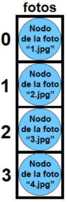
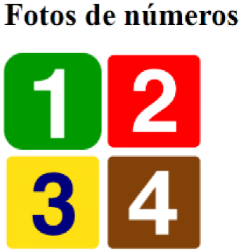

# U4 JavaScript

## Intro

Hasta ahora solo hemos creado páginas web estáticas. Esto significa que nunca cambiaban.
JavaScript se utiliza para crear páginas web dinámicas. Una web dinámica es aquella que puede cambiar según lo que suceda. Por ejemplo, que ocurra algo al pulsar un botón, que aparezcan o desaparezcan elementos...
En HTML creamos el contenido y en CSS le dábamos estilo. Ahora, además, usaremos JavaScript para dar comportamiento.
JavaScript, a diferencia de HTML y CSS, sí es un lenguaje de programación. Esto significa que:

* Es más complicado
* Se deben entender conceptos como "variable", "bucle", "función"..., que son básicos en cualquier lenguaje de programación.
* Este lenguaje es muy extenso, pero tranquilos... en esta asignatura solo veremos un poco de JS.

Existen 2 formas principales de agregar código JS a una web:

1. Dentro del archivo HTML, dentro de `<script></script>`.
2. En otro archivo con extensión .js, enlazado con `<script src=""></script>`.

En ambas formas, la línea `<script...>` del HTML se puede colocar en 2 lugares:

* Dentro de `<head></head>` (Por el momento lo haremos así).
* Antes de `</body>` (última línea del BODY). (Veremos que a veces es necesario).


## Dos formas de agregar código JS

### En el mismo archivo HTML

La primera manera de agregar código JS es hacerlo en el mismo archivo HTML.

Ejemplo 1

```html
<!DOCTYPE html>
<html lang="es">
<head>
    <meta charset="utf-8">
    <title>PRUEBAS JS</title>
    <script>
        document.write("Hola desde JS<br>");
    </script>
</head>
<body>
    Hola desde HTML<br>
</body>
</html>
````

```txt
Hola desde JS
Hola desde HTML
```

Ejemplo 2

```html
<!DOCTYPE html>
<html>
<head>
    <meta charset="utf-8">
    <title>PRUEBAS JS</title>
</head>
<body>
    Hola desde HTML<br>
    <script>
        document.write("Hola desde JS<br>");
    </script>
</body>
</html>
```

```txt
Hola desde HTML
Hola desde JS
```

### En otro archivo .JS

La segunda forma de agregar código JS es hacerlo en otro archivo diferente, con extensión .js y que estará vinculado al HTML con la línea `<script src="">`.

Por ejemplo:

```html
<!DOCTYPE html>
<html lang="es">
<head>
    <meta charset="utf-8">
    <title>PRUEBAS JS</title>
    <script src="miscript.js"></script>
</head>
<body>
    Hola desde HTML
</body>
</html>
```

```js
document.write('Hola desde JS<br>");
```

```txt
Hola desde HTML
Hola desde JS
```

El mismo ejemplo, pero con la linea `<script src="miscript.js"></script>` antes de `</body>` mostraría

```txt
Hola desde JS
Hola desde HTML
```

## Alert

Esta instrucción sirve para que el navegador muestre un mensaje de alerta con el texto que coloques entre comillas. Es una ventana emergente cuyo aspecto dependerá del navegador en el que nos encontremos.

Por ejemplo

```js
alert("¡Hola mundo!");
```

## Document.Write

Esta instrucción se utiliza para escribir en el HTML desde JavaScript.

```js
document.write("Hola mundo");
document.write("Hola <u>mundo</u>");
```

> **¡Atención!** En realidad, esta NO es la mejor opción para añadir texto desde JS, ya que, como se vio en los ejemplos iniciales, siempre se agregaría al principio o al final de la página web. Solo lo usaremos en los primeros ejercicios. Normalmente, querremos colocar el nuevo texto (o lo que sea) en lugares específicos, y para eso veremos métodos mejores...

## La consola del navegador

Cuando escribimos un código JavaScript, es normal que no funcione a la primera, ya que los lenguajes de programación son muy estrictos y cualquier pequeño error puede provocar que falle. Pero, ¿cómo sabemos dónde está el error?

Para eso, nos puede ayudar la **consola** del navegador que estemos utilizando. En el caso de Google Chrome, se puede acceder a la consola haciendo clic derecho en la página web, seleccionando *Inspeccionar* o *Más herramientas* y luego *Herramientas para desarrolladores*. Una vez en las herramientas para desarrolladores, podemos encontrar la consola en la pestaña *Consola*. Allí, el navegador nos mostrará mensajes de error y otros tipos de información útiles para **depurar** nuestro código JavaScript.

Por ejemplo, con este código...

```js
alert(hola);
```

...si abrimos la página que utiliza este script, en la consola aparecerá este error:

```
Uncaught ReferenceError: hola is not defined
```

Corregimos esto (faltan las comillas) y en la consola ya no aparece nada.

### console.log

console.log("Text per a proves");

Sirve para mostrar cosas en la consola del navegador (NO EN LA WEB). Por ejemplo:

```js
console.log("Probando...");
```

Esto mostrará "Probando..." en la consola del navegador.

Puede parecer algo trivial, pero esta opción es muy útil para realizar pruebas. En el futuro, cuando los códigos sean más complicados, mostrar cosas por la consola nos puede ayudar a realizar comprobaciones.

## Concepto de variable

Un concepto fundamental en cualquier lenguaje de programación (no solo en JavaScript) es el de variable. Pero, ¿qué es una variable?

Una variable es un espacio de memoria que se reserva para almacenar un dato. Para entenderlo más fácilmente, imagina que es una "caja" que contendrá algo (texto, número...) que utilizaremos en nuestro programa (en este caso, nuestra web). A esta "caja" se le asigna un nombre para poder referirnos a ella.

Ejemplos

* Podríamos crear una variable llamada *nombre* que contenga la palabra *Chechu*.
* Podríamos crear una variable llamada *edad* que contenga el número *23*.

### let nombreVariable = valorInicial;

Se utiliza para **declarar una variable e inicializarla**. Dicho de otra forma más sencilla: sirve para crear una "caja" interna (con un nombre) y poner algo dentro de ella.

Ejemplos

```javascript
// Creamos una variable llamada numero1 que contiene un 5.
let numero1 = 5; 

// Creamos una variable llamada mi_texto que contiene "hola".
let mi_texto = "hola"; 

//Creamos una variable llamada precio que por ahora está vacía.
let precio;
```

`let` tiene un ámbito de bloque. Por lo tanto, si está definida dentro de un bloque (un trozo de código delimitado por `{}`), solo podrá utilizarse en ese bloque. Es importante destacar esto.

### nombreVariable = nuevoValor;

```javascript
nombreVariable = nuevoValor;
```

Se utiliza para **asignar un valor** a una variable ya creada. Dicho de otra forma más sencilla: elimina lo que había dentro de una "caja" interna y coloca dentro `nuevoValor`.

Por ejemplo:

```javascript
// Creamos una variable llamada numero1 que contiene el un 5
let numero1 = 5;

// Eliminamos lo que hubiera dentro de numero1 y le asignamos el valor 8.
numero1 = 8;
```

### Concatenaciones (+)

El símbolo `+`, además de para sumar (como verás en la diapositiva siguiente), se utiliza en JavaScript para unir texto con variables en las frases. Esto se llama **concatenar**.

```javascript
let nombre = "Bartolo";
document.write("Me llamo " + nombre);
```

```javascript
let nombre = "Bartolo";
let frase = "Me llamo " + nombre;
document.write(frase);
```

```txt
Me llamo Bartolo
```

### Operadores aritméticos

Podemos realizar operaciones con variables que contengan números. Los operadores básicos son:

* Suma: +
* Resta: -
* Producto: *
* División: /

Otros operadores menos frecuentes:

* Potencia: **
* Resto de la división: %

Por ejemplo:

```javascript
let hombres = 23;
let mujeres = 7;
let total = hombres + mujeres;
document.write("Hay " + total + " personas");
```

```txt
Hay 30 personas
```

### Incrementos y decrementos (++ y --)

Si queremos sumar 1 a una variable (esto también se llama incrementarla), la forma más rápida es esta:

```javascript
nombreVariable++;
```

Por ejemplo:

```javascript
let edad = 36;
edad++;
document.write("Tengo " + edad + " años");
```

De la misma forma, la instrucción `nombreVariable--;` resta 1 a la variable (esto también se llama decrementarla).

Esto será muy importante cuando veamos los bucles...

> En el ejemplo anterior, también se podría haber hecho `edad = edad + 1;`, pero como ves, el `++` es mucho más directo.

### Const

Se utiliza para declarar una variable constante. Esto significa que no podemos cambiar su valor.

```javascript
// Crearemos una constante llamada size que contiene un 10.
const size = 10;
```

Por ejemplo:

```javascript
const size = 10;
size = 11;
```

No podríamos hacer eso. El valor de una constante no puede cambiar, y la consola mostrará un error.

```txt
Uncaught TypeError: Assignment to constant variable.
```

### ¿var?

Hace años, en JavaScript, todas las variables se declaraban con `var`. Sin embargo, actualmente NO se recomienda su uso, y se aconseja utilizar `let` y `const`.

Si quieres saber los motivos o te interesa el tema, puedes leer este artículo:

[https://www.freecodecamp.org/espanol/news/var-let-y-const-cual-es-la-diferencia/](https://www.freecodecamp.org/espanol/news/var-let-y-const-cual-es-la-diferencia/)

### let nombreVariable = prompt("Mensaje");

Sirve para que el navegador muestre una ventana con una pregunta al usuario. Lo que él escriba se guardará en la variable llamada `nombreVariable`.

Por ejemplo:

```javascript
let num = prompt("Dime un número pisha");
document.write("Has dicho el número " + num + ". ¡Adiós!");
```

Con este código, al abrir la página web, aparecerá:

```txt
Esta página dice:
Dime un número pisha

[Cancelar] [Aceptar]
```

Y si escribes un 3 y aceptas, la página web mostrará:

```txt
Has dicho el número 3. ¡Adiós!
```

### Condicionales

Hasta ahora, en los scripts que hemos hecho, se ejecutaban **todas** las líneas, una por una y de arriba abajo.

Pero claro, en programación eso no siempre es así. A veces queremos que se ejecuten unas líneas únicamente si ha ocurrido algo. Por ejemplo, en un juego, queremos sumar una vida al jugador si ha recogido 100 monedas. Aquí es donde entran en juego los condicionales, que son muy importantes cuando programamos.

Un condicional es una estructura que, como su propio nombre indica, ejecuta un conjunto de instrucciones únicamente si se cumple una condición (o si no se cumple).

>[!Todo]
>Añadir diagrama de flujo

```javascript
if(condició) { Instruccions si V }
```

Sirve para ejecutar instrucciones unicamente si se cumple la condición entre paréntesis. IF significa "si..."

```javascript
let numero = prompt("Dime un número pisha", "");
if(numero>0) {
     document.write("Dijiste un número positivo<br>");
}
document.write("Adiós");
````

Con este código, si el usuario escribe 7 se verá:

```javascript
/* Con este código, si el usuario escribe 7 se verá: */
Dijiste un número positivo
Adiós
/* No obstante, si escribe -3, solamente verá: */
Adiós
```

>[!Alert]
> Fíjate en que la frase "Adiós" se escribirá **siempre** porque está fuera del ``if``.

---

>[!Todo]
> Añadir diagrama de flujo

```javascript
if(condició) { Instruccions si V }
else { Instruccions si F }
```


```javascript
if(condició1) { Instruccions si V }
elseif(condició2) { Instruccions si V }
elseif(condició3) { Instruccions si V }
else { Instruccions en cas contrari }
```


## Operadores de comparación

| Operador | Nombre            | Ejemplos    |
|----------|-------------------|-------------|
| `>`        | Mayor que         | `7 > 4` → VERDADERO<br> `4 > 7` → FALSO |
| `<`        | Menor que         | `4 < 7` → VERDADERO<br> `7 < 4` → FALSO |
| `>=`        | Mayor o igual que | `4 >= 4` → VERDADERO<br> `7 >= 4` → VERDADERO |
| `<=`       | Menor o igual que | `7 <= 7` → VERDADERO<br> `4 <= 7` → VERDADERO |
| `==`       | Igual que         | `4 == 4` → VERDADERO<br> `7 == 4` → FALSO |
| `!=`       | Distinto a        | `9 != 28` → VERDADERO<br> `4 != 4` → FALSO |

> ¡NO CONFUNDAS = CON ==!
>
> * Un igual es ASIGNACIÓN ("es igual a")
> * Dos iguales (==) es COMPARACIÓN ("¿es igual")

## Operadores lógicos

| Operador | Nombre | Ejemplos |
|----------|--------|----------|
| && | Y | `((7>4) && (5>3))` sería VERDADERO<br>`((7>4) && (2>3))` sería FALSO |
| \|\| | O | `(7>4) \|\| (2>3))` sería VERDADERO<br> `((1>4) \|\| (2>3))` sería FALSO |
| ! | NO | `(!(1>4))` sería VERDADERO<br> `(!(7>4))` sería FALSO |

## WHILE, FOR


## ARRAYS


## Document Object Model

### Antes de nada

Lo que hemos visto en los 4 primeros ejercicios (variables, condicionales, arrays y bucles) son en realidad conceptos generales de casi todos los lenguajes de programación.

A partir de ahora veremos cosas específicas de JavaScript, para comprobar el "poder" que puede tener este lenguaje sobre una página web (aunque tampoco veremos todo lo que se puede hacer, por falta de tiempo).

### DOM

Las siglas DOM significan Document Object Model. Una página HTML está formada por múltiples etiquetas HTML, anidadas una dentro de la otra, formando un árbol de etiquetas (que internamente es un árbol de nodos).

```html
<!DOCTYPE html>
<html>
<head>
    <meta charset="utf-8">
    <title>Página</title>
</head>
<body>
    <p>Esta página es <strong>muy sencilla</strong></p>
</body>
</html>
```


Entonces, sabiendo cómo realizar estas 4 operaciones...

1) Acceder a los nodos del DOM
2) Modificar los nodos del DOM
3) Eliminar nodos del DOM
4) Agregar nuevos nodos en el DOM

...podremos hacer muchas cosas en la web desde JavaScript.

### Acceder a los nodos del DOM

Todos los nodos parten de un nodo llamado document, que está en la parte superior del árbol (representa a la página entera). Y luego, con el punto (.), podemos ir descendiendo nodos del árbol.

Por lo tanto, acceder a todo el BODY y cambiarle el color es sencillo:

```javascript
document.body.style.backgroundColor = "yellow";
```

Con esto ya hemos "encontrado" el BODY.

Esta es la parte (modificar un nodo) que veremos más adelante.

Pero claro... ¿y si tuviéramos que acceder a un nodo mucho más específico? Por ejemplo, el tamaño de la primera caja del primer formulario. Tendríamos que hacer algo así:

```javascript
document.forms[0].elements[0].size = "200px";
```

> Descender por todo el árbol de nodos sería una locura. Pero tranquilo, ahora veremos una forma mucho más fácil...

### Modificar los nodos del DOM

Una vez que he accedido al nodo que quiero y lo tengo guardado en una variable, la "gracia" es que puedo cambiarle lo que quiera, accediendo a sus características con punto (.) y dándole nuevos valores.

Si queremos modificarle un atributo HTML, se hace directamente. No obstante, si es una propiedad CSS, es necesario agregar antes "style".

#### Ejemplo 1 (modificar atributo HTML)

He accedido a un input de texto de un formulario y lo tengo guardado en una variable llamada "caja".
Quiero cambiarle su texto. Haría esto:

```javascript
caja.value = "Hola";
```


¡Magia! Hemos escrito dentro desde JavaScript

#### Ejemplo 2 (modificar propiedad CSS)

En la variable "titulo", quiero cambiarle su color. Haría esto:

```javascript
titulo.style.color = "green";
```


¡Magia! Lo hemos puesto verde desde JS.

> Si el atributo CSS que queremos cambiar lleva guion (como background-color), desaparece y la segunda palabra va en mayúsculas: `backgroundColor`

### Atención

A partir de ahora, para que los ejercicios de DOM funcionen, tendremos que colocar la línea de `<script...></script>` AL FINAL DEL BODY:

```html
<!DOCTYPE html>
<html>
<head>
    <!-- Código del encabezado -->
    <meta charset="utf-8">
</head>
<body>
    <!-- Contenido del cuerpo -->
    Bla bla bla
    Bla bla bla
    Bla bla bla

    <script src="miscript.js"></script>
</body>
</html>
```

Esto es porque, si la línea `<script...></script>` está en el HEAD, el script se ejecuta ANTES de que la web se cargue. Entonces, es imposible encontrar nodos...

### getElementsByTagName

Además de getElementById, hay otros "atajos" para acceder...

Permite acceder a todos los nodos que sean de un tipo de etiqueta HTML. Por ejemplo: a todos los IMG, a todos los H1, a todos los LI...

> ¡Muy importante!
>
> getElementById devolvía directamente un nodo, pero getElementsByTagName devuelve un array de nodos.
>
>Después habrá que recorrerlo para modificar lo que queramos...

```html
<body>
    <h1>Fotos de números</h1>
      <br>
     
</body>
```

```javascript
// Con esto he encontrado todas las imágenes de mi web (en este caso, 4). Las tengo en un array.
let fotos = document.getElementsByTagName("img");
for (let i = 0; i < fotos.length; i++) {
    fotos[i].style.height = "100px";
}
```





**¡Magia!** Reducimos todas las imágenes desde JS.

> No es realmente un array, sino una `HTMLCollection`. Sin embargo, es una estructura similar...

### getElementsByClassName

Este es otro "atajo" que permite acceder a los nodos HTML que tengan una CLASS específica.

Al igual que el anterior, devuelve una colección de HTML (un array de nodos) que necesitarás recorrer...

```html
<body>
    <h1>Fotos de números</h1>
    
     <br>
    
    
</body>
```

```javascript
// Con esto he encontrado los 3 nodos que pertenecen a la CLASS "fotazas" y los tengo en un HTMLCollection.
let fotazas = document.getElementsByClassName("fotazas");
for(let i = 0; i < fotazas.length; i++) {
    fotazas[i].style.height = "100px";
}
```

**¡Magia!**
Hemos reducido 3 de las 4 imágenes desde JS.

| Método            | Tipo de retorno |
|-------------------|-----------------|
| `getElement...`   | Nodo            |
| `getElements...`  | "Array"         |


### Eliminar nodos del DOM

Una vez que he accedido al nodo que quiero y lo tengo guardado en una variable, otra operación que podemos hacer es eliminar el nodo. Desaparecerá, por lo tanto, de la página web. Se hace escribiendo `.remove()` después de la variable que contiene el nodo a borrar.

```html
<body>
    <h1>súper web</h1>
    <h2 id="subtitulo">Sean bienvenidos</h2>
    
</body>
```

```javascript
// Encuentro el elemento H2 con getElementById() y lo guardo en una variable. Luego lo elimino con remove().
let subtitulo = document.getElementById("subtitulo");
subtitulo.remove();
```

> En el HTML seguirá estando el H2. Solo se borra en ese momento, para esa vez que hemos abierto la web.

Y si queremos eliminar un conjunto de nodos? En este caso, necesitarás recorrer el HTMLCollection (array) y eliminar uno por uno... ¡pero cuidado! Dependiendo de cómo lo hagas, es posible que no logres eliminar todos...

```html
<p>111</p>
<p>222</p>
<p>333</p>
<p>444</p>
<p>555</p>
<p>666</p>
<p>777</p>
<p>888</p>
<p>999</p>
```

```javascript
let parrafos = document.getElementsByTagName("p");
for (let i = 0; i < parrafos.length; i++) {
    parrafos[i].remove();
}
```

```javascript
let parrafos = document.getElementsByTagName("p");
for (let i = parrafos.length - 1; i >= 0; i--) {
    parrafos[i].remove();
}
```

> ¿Por qué crees que esto está ocurriendo?

### Agregar nuevos nodos al DOM

Ya sabemos cómo acceder, modificar y eliminar nodos del DOM. Solo nos falta agregar nuevos nodos. Esta puede ser la acción más compleja de las cuatro (aunque depende de lo que queramos agregar).

Para agregar una etiqueta simple (H1, P, IMG...), los pasos son los siguientes:

1. Creamos la etiqueta vacía con createElement.
2. Modificamos las propiedades (HTML o CSS) que deseemos.
3. Usamos `appendChild` para agregar esta etiqueta al nodo que queremos que sea su padre (antes, debemos buscar esta etiqueta que será el padre...).

Ejemplo 1: Agregar un Párrafo al final de la página web

```javascript
let parrafo = document.createElement("P");
// Con esto hemos creado <p></p>
parrafo.innerHTML = "Hola, ¿qué haces?";
// Hemos agregado "Hola, ¿qué haces?" dentro de <p>
document.body.appendChild(parrafo);
// Como lo queremos al final de la página web, el nuevo nodo será hijo del body. Por eso le hacemos appendChild al body, que encontramos que está así de fácil.
```

Ejemplo 2: Agregar una Imagen en una zona específica

```javascript
let foto = document.createElement("IMG");
// Con esto hemos creado </img>
foto.src = "fotos/paquirrin.jpg";
// Hemos colocado el src="fotos/paquirrin.jpg" dentro de 
let zona1 = document.getElementById("zona1");
zona1.appendChild(foto);
// En este caso, no queremos agregar el nodo al final de la página web, sino en una zona (div) específica. Primero encontramos el nodo del div, y es a él a quien le hago el appendChild.
```
